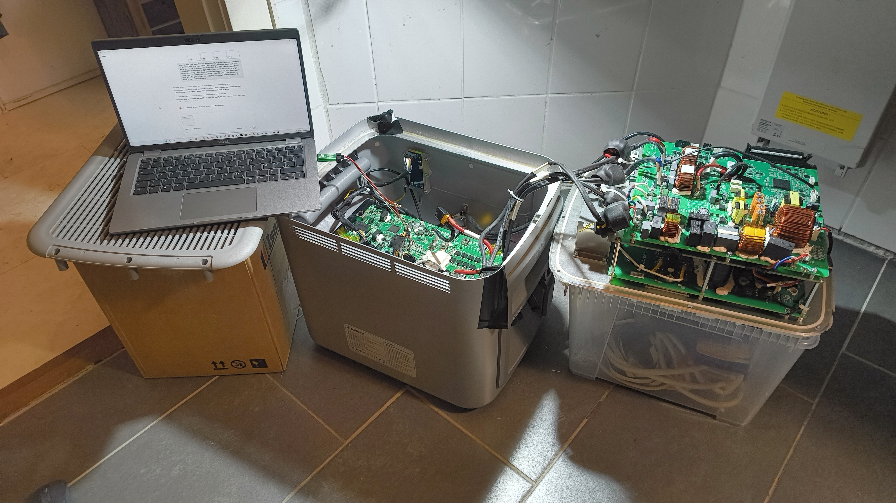

# Maker Media GmbH

# Jackery Navi 2000 — BMS-Lockout per Reverse Engineering aufheben

Ein Jackery Navi 2000 Heimspeicher war nach einer Tiefentladung durch einen Software-Lockout (`CellUVLock`) dauerhaft gesperrt — obwohl alle 16 Zellen längst wieder gesund waren. Mit einem 6-Euro-ST-Link-Adapter, pyOCD und KI-unterstütztem Reverse Engineering der ARM-Firmware wurde der Fehler lokalisiert und behoben, ohne die Firmware zu verändern.

**Den vollständigen Artikel gibt es in der Make-Ausgabe 5/26.**

## Skripte

Alle Skripte liegen im Ordner `analysis/` und benötigen Python 3, [pyOCD](https://pyocd.io/) und [Capstone](https://www.capstone-engine.org/) (`pip install pyocd capstone`).

### Der Fix

| Skript | Beschreibung |
|--------|-------------|
| `clear_lock_boot.py` | **Das Fix-Skript:** Setzt beim Boot einen Breakpoint und leitet die Firmware in ihren eigenen Rebuild-Pfad um, der die Fault-Flags im SPI-Flash löscht. |

### Analyse und Diagnose

| Skript | Beschreibung |
|--------|-------------|
| `fw.py` | Firmware-Toolkit: String-Suche und Cross-Referenzen im Flash-Dump. |
| `disasm.py` | Thumb-2-Disassembler mit automatischer Auflösung von PC-relativen Literalen. |
| `func.py` | Findet Funktions-Prologues rückwärts und scannt nach Dispatch-Tabellen. |
| `live_faults.py` | Decodiert alle 67 Einträge des Fault-Dictionary aus dem Firmware-Flash. |
| `ccm_decode.py` | Decodiert den Alarm-Ringpuffer und Kontextdaten aus CCM/SRAM-Dumps. |
| `after_cable.py` | Vergleicht RAM-Dumps vor und nach dem Wiedereinstecken des BMS-Kabels. |
| `recon.py` | Liest SCB-Fault-Register, Backup-SRAM und strukturelle RAM-Unterschiede aus. |
| `walk_list.py` | Verfolgt verkettete Listen (Linked Lists) in RAM-Dumps. |
| `bq_status.py` | Liest den BQ76952-AFE-Status, Zellspannungen und Schutz-Flags über SWD aus. |

### Der Durchbruch: Hardware-Watchpoints

| Skript | Beschreibung |
|--------|-------------|
| `watch_lock.py` | Setzt einen Schreib-Watchpoint auf den Alarm-Ring und fängt den Boot-Schreiber des Faults ab. |
| `watch_lock2.py` | Setzt einen Schreib-Watchpoint auf das Device-Fault-Word, um die CellUVLock-Entscheidung zu lokalisieren. |

### Live-Monitoring über SWD

| Skript | Beschreibung |
|--------|-------------|
| `monitor_charge.py` | Überwacht live Zellspannungen, Packstrom und Fault-Status. |
| `lock_test.py` | Testet, ob der CellUVLock nach RAM-Clear und Power-Cycle zurückkehrt. |
| `ems_mode.py` | Zeigt den aktuellen EMS-Betriebsmodus beim Umschalten in der App. |
| `ems_batpower_watch.py` | Beobachtet den Batterie-Leistungssollwert der EMS-Regelschleife. |
| `ems_charge_probe.py` | Analysiert das Ladeverhalten im Self-Consumption-Modus bei PV-Überschuss. |
| `ems_meter_dump.py` | Dumpt EMS/Meter/PCS-RAM-Blöcke als Floats zur Feldidentifikation. |

### Fehlgeschlagene Versuche (als Referenz behalten)

| Skript | Beschreibung |
|--------|-------------|
| `clear_word.py` | Löscht das CellUVLock-Bit direkt im RAM — kehrt nach Neustart zurück. |
| `clear_all.py` | Löscht Fault-Word und Alarm-Ring im RAM — kehrt nach Neustart zurück. |
| `inject_clearlock.py` | Ruft `DeviceAlarmActionBy32BitCode` per Injection auf — hängt am Mutex. |
| `inject_wake.py` | Injiziert Inverter-Wake/Force-Charge-Befehle — keine Wirkung auf den Lock. |
| `inject_forcechg.py` | Force-Charge-Injection — Befehl wird ausgeführt, Lock bleibt. |
| `inject_all.py` | Probiert alle Inverter-Recovery-Befehle durch — keiner löst den Lock. |
| `dump_eeprom.py` | Dumpt das externe I²C-EEPROM über eine injizierte Firmware-Funktion. |
| `eeprom_diag.py` | Einzelaufruf-Diagnose des EEPROM mit detaillierter Ausgabe. |

